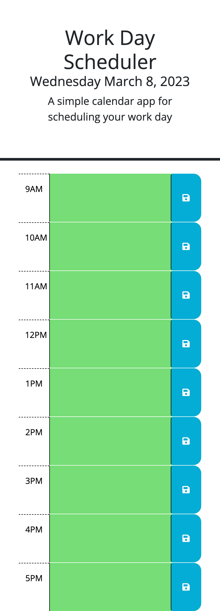
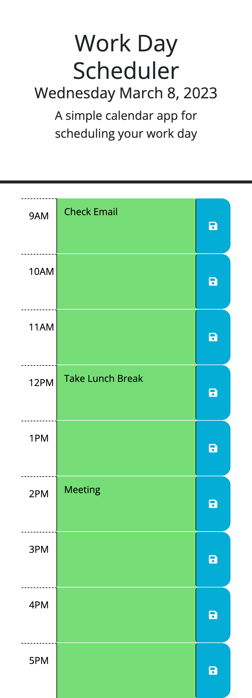
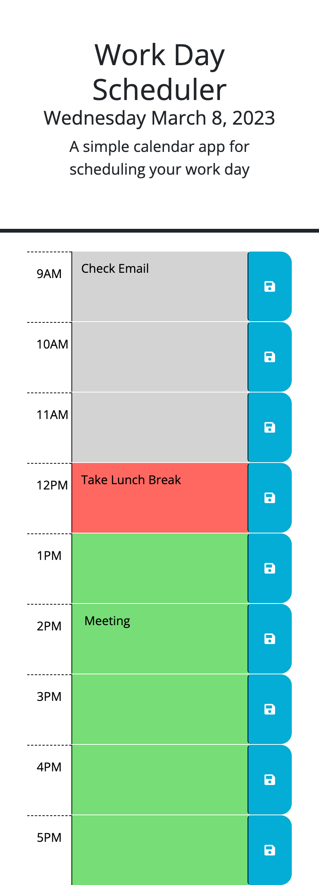

# workday-scheduler
Module 5: Javascript Third Party APIs

## User Story

```md
AS AN employee with a busy schedule
I WANT to add important events to a daily planner
SO THAT I can manage my time effectively
```

## Acceptance Criteria

```md
GIVEN I am using a daily planner to create a schedule
WHEN I open the planner
THEN the current day is displayed at the top of the calendar
WHEN I scroll down
THEN I am presented with timeblocks for standard business hours
WHEN I view the timeblocks for that day
THEN each timeblock is color coded to indicate whether it is in the past, present, or future
WHEN I click into a timeblock
THEN I can enter an event
WHEN I click the save button for that timeblock
THEN the text for that event is saved in local storage
WHEN I refresh the page
THEN the saved events persist
```

## Usage
When visiting the web page, user will see: 



When clicking into the boxes for each hour, user can input text to save on button click, which will remain when the page is refreshed:



The color of the text boxes will change based on time of day.
```
Green: Future events
Red: Current events
Gray: Past events
```



## Credits
```
Columbia Engineering Coding Bootcamp: Source Code
Worked on event storage with tutor - Geronimo Perez
```